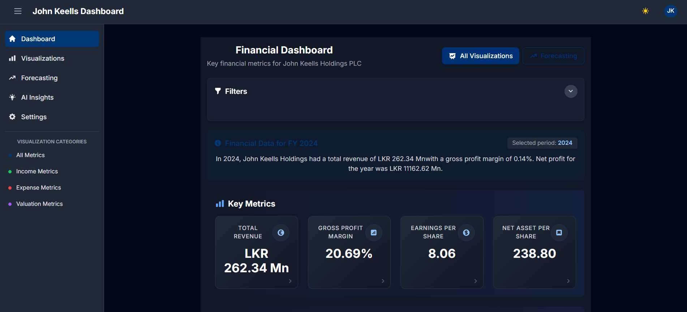

# JK Financial Dashboard

A comprehensive financial analytics dashboard that extracts, processes, and visualizes data from John Keells Holdings annual reports.



## 📋 Overview

The JK Financial Dashboard provides detailed financial data analysis and visualizations for John Keells Holdings. The application extracts financial information from PDF annual reports, processes the data, and presents it through an interactive web dashboard.

## 🔧 Features

- **Interactive Visualizations**: Charts and graphs for revenue, profit margins, EPS, and more
- **Industry Group Analysis**: Breakdown of performance by industry segments
- **Financial Trends**: Multi-year analysis of key financial indicators
- **Top Shareholders**: Historical data on major shareholders
- **Rights Issues Data**: Information about past rights issues
- **AI-Powered Insights**: Machine learning forecasting and anomaly detection
- **Exportable Reports**: Download data and visualizations in various formats

## 🏗️ Project Structure

```
jk-financial-dashboard/
├── backend/                 # Python API and data processing code
│   ├── app.py               # Main Flask application
│   ├── run.py               # Server startup script
│   ├── requirements.txt     # Python dependencies
│   ├── tests/               # Backend unit tests
│   └── scripts/             # Data extraction and processing scripts
│       ├── extract_financial_data.py  # PDF extraction script
│       ├── annual_reports/   # Source PDF files
│       └── extracted_data/   # Processed data storage
│
├── frontend/                # React frontend application
│   ├── src/
│   │   ├── components/      # Reusable UI components
│   │   ├── pages/           # Page components
│   │   ├── context/         # React context providers
│   │   ├── api/             # API integration services
│   │   ├── hooks/           # Custom React hooks
│   │   ├── utils/           # Utility functions
│   │   ├── assets/          # Static assets and images
│   │   ├── App.jsx          # Main application component
│   │   └── main.jsx         # Application entry point
│   ├── public/              # Static files
│   ├── index.html           # HTML template
│   ├── package.json         # Frontend dependencies
│   └── vite.config.js       # Vite configuration
│
└── README.md                # Project documentation
```

## 🚀 Setup Instructions

### Prerequisites

- **Node.js**: v18.0.0 or higher
- **Python**: 3.9 or higher
- **pip**: Latest version
- **npm**: Latest version

### Docker Setup (Recommended)

The easiest way to run the application is using Docker:

1. Make sure you have Docker and Docker Compose installed on your system

2. Clone the repository:
   ```bash
   git clone <repository-url>
   cd jk-financial-dashboard
   ```

3. Build and start the containers:
   ```bash
   docker-compose up -d
   ```

4. Access the dashboard at:
   - Frontend: http://localhost
   - Backend API: http://localhost:5000/api

5. To stop the containers:
   ```bash
   docker-compose down
   ```

### Backend Setup (Manual)

1. Navigate to the backend directory:
   ```bash
   cd backend
   ```

2. Create and activate a virtual environment (recommended):
   ```bash
   # Windows
   python -m venv venv
   venv\Scripts\activate

   # macOS/Linux
   python -m venv venv
   source venv/bin/activate
   ```

3. Install required dependencies:
   ```bash
   pip install -r requirements.txt
   ```

4. Run the backend server:
   ```bash
   python run.py
   ```

   The API will be available at: http://localhost:5000/api

### Frontend Setup (Manual)

1. Navigate to the frontend directory:
   ```bash
   cd frontend
   ```

2. Install dependencies:
   ```bash
   npm install
   ```

3. Create a `.env.development` file in the frontend directory with:
   ```
   VITE_API_URL=http://localhost:5000/api
   ```

4. Start the development server:
   ```bash
   npm run dev
   ```

   The dashboard will be available at: http://localhost:5173

## 📊 Using the Dashboard

### Main Features

- **Home Dashboard**: Overview of key financial metrics
- **Visualizations**: Detailed charts and graphs of financial data
- **Forecasting**: Machine learning-based financial forecasting
- **AI Insights**: Automated analysis and insights
- **Settings**: Customize dashboard appearance and preferences

### Available Charts

- Revenue Trends (Annual & Quarterly)
- Cost of Sales vs Operating Expenses
- Gross Profit Margin Analysis
- Earnings Per Share (EPS) History
- Net Asset Value Per Share
- Industry Group Performance Comparison
- Top 10 Shareholders Distribution
- Rights Issues Timeline

## 📈 Data Structure

The API provides data in the following structure:

```json
{
  "industryGroups": ["Transportation", "Leisure", "Consumer Foods", ...],
  "yearlyData": [
    {
      "year": 2019,
      "financials": {
        "revenue": 135500,
        "costOfSales": 98250,
        "operatingExpenses": 12750,
        "grossProfit": 37250,
        "grossProfitMargin": 27.5,
        "eps": 11.23,
        "netAssetPerShare": 80.37
      },
      "events": [...]
    }
  ],
  "rightIssues": [...],
  "topShareholders": {
    "2019": [...],
    "2020": [...]
  }
}
```

## 🧪 Testing

The project includes comprehensive unit tests for both backend and frontend components.

### Backend Tests

Backend tests are written using Python's unittest framework.

```bash
# Navigate to the backend directory
cd backend

# Run all tests
python run_tests.py

# Or run tests directly with pytest
python -m pytest
```

### Frontend Tests

Frontend tests are written using Jest and React Testing Library.

```bash
# Navigate to the frontend directory
cd frontend

# Run all tests
npm test

# Run tests in watch mode (for development)
npm run test:watch

# Run tests with coverage report
npm run test:coverage
```

### Test Coverage

The test suite covers:

- **Backend**:
  - API endpoints
  - Data processing functions
  - Forecasting algorithms
  - Error handling

- **Frontend**:
  - API service functions
  - React components
  - Data visualization components
  - State management

## 🔒 Environment Variables

### Backend
- No additional environment variables required for development

### Frontend
- `VITE_API_URL`: URL to the backend API

## 🛠️ Technologies Used

### Backend
- **Flask**: Web framework
- **pandas**: Data processing
- **pdfplumber/camelot/tabula**: PDF data extraction
- **scikit-learn/TensorFlow**: Machine learning for forecasting

### Frontend
- **React**: UI library
- **Vite**: Build tool
- **Chart.js/D3.js**: Data visualization
- **React Router**: Navigation
- **Tailwind CSS**: Styling
- **Jest/React Testing Library**: Testing

## 🐳 Docker Deployment

The application includes Docker configuration for easy deployment:

- `docker-compose.yml`: Orchestrates the entire application
- `backend/Dockerfile`: Container configuration for the Python backend
- `frontend/Dockerfile`: Multi-stage build for the React frontend

### Building the Docker Images

```bash
# Build both images
docker-compose build

# Build a specific service
docker-compose build backend
docker-compose build frontend
```

### Managing Docker Containers

```bash
# Start all services in the background
docker-compose up -d

# View logs
docker-compose logs -f

# Stop all services
docker-compose down

# Rebuild and restart services
docker-compose up -d --build
```

## 📄 License

This project is proprietary and confidential.

## 👥 Contributors

- John Keells Holdings Financial Analytics Team